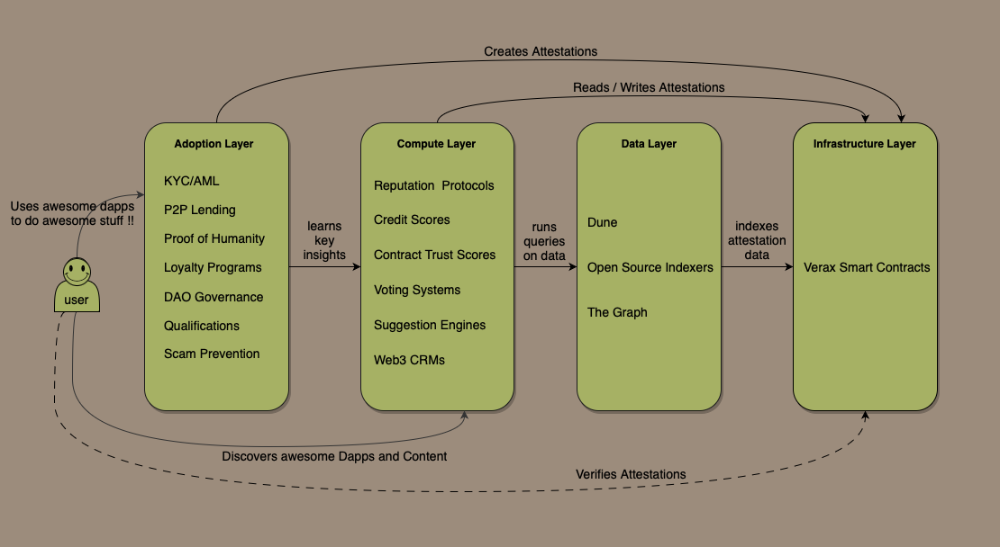
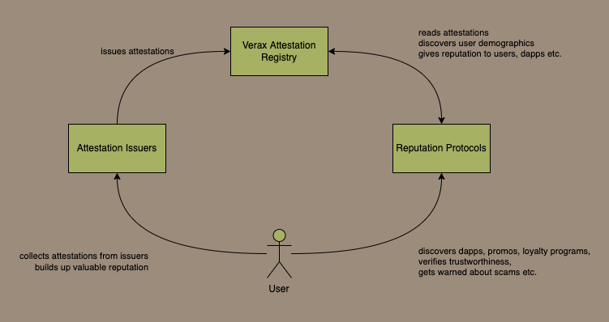

# Ecosystem

Verax is best understood as shared attestation infrastructure rather than as a single dApp.

<figure><figcaption>
A layered view of the Verax ecosystem: protocol, access, builders, and research/consumption.
</figcaption></figure>

## Protocol layer

The base layer is the Verax deployment on each supported chain:

- router;
- registries;
- canonical schemas;
- issuer portals;
- reusable modules.

This layer defines how attestations are written and discovered.

## Access layer

Developers and researchers usually access Verax through:

- the SDK for application code;
- the subgraph for indexed queries;
- the explorer for human browsing;
- direct contract reads when they need onchain guarantees.

## Builder layer

Applications can use Verax in two very different ways:

- as issuers, by publishing attestations through their own portal;
- as consumers, by reading schemas, portals, and attestations created by others.

One of Verax's advantages is that both roles can coexist. A team can issue its own attestations while consuming third
party attestations from the same registry.

## Research layer

Researchers can use Verax as a shared attestation dataset for:

- issuer behavior analysis;
- schema standardization studies;
- relationship graph analysis;
- trust and provenance experiments;
- cross-chain attestation discovery.

This is where canonical schemas, chain-prefixed IDs, and linked-data conventions become especially important.

## Reputation and market structure view

Another useful lens is to think of Verax as shared reputation infrastructure:

- issuers publish claims;
- subjects accumulate or contest attestations;
- consumers and researchers derive meaning from public, queryable state;
- applications turn that shared state into product decisions, discovery, or analytics.

<figure><figcaption>
Verax can also be read as a shared reputation and discovery substrate, not only as a contract stack.
</figcaption></figure>

## Important distinction: protocol data vs editorial surfaces

Some Verax surfaces are protocol-backed and some are editorially curated.

- Registries, SDK reads, and subgraph entities are protocol-backed.
- Parts of the explorer home page and issuer showcase are curated UI data.

That distinction matters for research, analytics, and documentation accuracy.

## See also

- [Using the Explorer](../developer-guides/using-the-explorer.md)
- [Using the SDK](../developer-guides/using-the-sdk.md)
- [Using the Subgraph](../developer-guides/using-the-subgraph.md)
