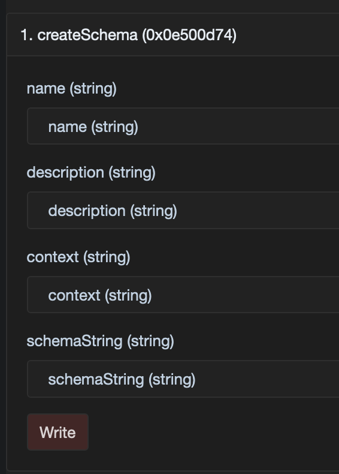

# Create and register a Schema

Before you can issue attestations into the registry, you will need a [Schema](../../core-concepts/schemas.md) upon which
to base those attestations.

Schema creation takes 4 parameters, defined as follows:

<table><thead><tr><th width="159.12290502793297">Parameter</th><th>Description</th></tr></thead><tbody><tr><td>name</td><td>An on-chain descriptive name for the schema.</td></tr><tr><td>description</td><td>The location of documentation for the schema (can be a URL, an IPFS hash, etc.), which describes its intended use and any relationships.</td></tr><tr><td>context</td><td>A link to a description of the schema's fields. You have two options: a URL linking to some shared ontology, or the attestation ID of a custom context.</td></tr><tr><td>schemaString</td><td>The actual schema string that describes the data structure of the attestations.</td></tr></tbody></table>

## Manually calling the `SchemaRegistry` smart contract

To create a Schema, you must call the `createSchema` function on the `SchemaRegistry` contract:

```solidity
function createSchema(
    string memory name,
    string memory description,
    string memory context,
    string memory schemaString
)
```

Then you need to get the logs from the transaction, and catch the Schema ID from there.

## Using a blockchain explorer

Instead of crafting the smart contract call by hand, you can benefit from a chain explorer interface. Let's use the
Linea Sepolia explorer, [Lineascan](https://sepolia.lineascan.build/).

<figure><figcaption><p>The form generated by Lineascan to interact with the <code>SchemaRegistry</code> contract</p></figcaption></figure>

1. Retrieve the `SchemaRegistry` contract address from the
   [project README](https://github.com/Consensys/linea-attestation-registry?tab=readme-ov-file#contracts-addresses)
2. Access the `SchemaRegistry` contract on
   [Lineascan](https://sepolia.lineascan.build/address/0x90b8542d7288a83EC887229A7C727989C3b56209)
3. Go to the ["Contract" tab](https://sepolia.lineascan.build/address/0x90b8542d7288a83EC887229A7C727989C3b56209#code)
4. Go to the
   ["Write as Proxy" tab](https://sepolia.lineascan.build/address/0x90b8542d7288a83EC887229A7C727989C3b56209#writeProxyContract)
5. Connect your allow-listed wallet and fill the `createSchema` form with the parameters described above
6. Send the transaction and watch the details of this transaction
7. Go to the
   ["Logs" tab](https://sepolia.lineascan.build/tx/0x54d154d8006b5fbb902a3e4f66ea3ff5810e8b6e1b18e90fbcdfd395cab57983#eventlog)
   and grab the Schema ID
8. In the example, it's `0xa288e257097a4bed4166c002cb6911713edacc88e30b6cb2b0104df9c365327d`

## Using the official Verax SDK

We have seen rather manual ways to create a Schema, now let's focus on the easiest way: via the Verax SDK.

 Check
[this page](https://docs.ver.ax/verax-documentation/developer-guides/tutorials/from-a-schema-to-an-attestation#id-2.-instantiate-the-verax-sdk)
to discover how to instantiate the Verax SDK. 

Once you have an SDK instance, you can create a Schema like this:

```typescript
await veraxSdk.schema.create(
  "Example Schema",
  "This Schema is used as an example",
  "https://docs.ver.ax",
  "(bool isExample, bool isWorking)",
);
```

## The Schema String Syntax

A schema string is a comma separated list of data type + field name tuples, for example:

`(string firstName, string lastName)`

 The schema _should be_ wrapped in outer round brackets. It is best practice as it will make it
easier for different clients to parse the schema, but also for you to use it from the SDK. 

The data types can be any valid Solidity datatype:

1. **Boolean**: Identified by the `bool` keyword. Represents a boolean value: `true` or `false`.
2. **Integer**: Represents signed integers of various sizes. Examples include `int8`, `int16`, `int256`, etc.
3. **Unsigned Integer**: Represents unsigned integers of various sizes. Examples include `uint8`, `uint16`, `uint256`,
   etc.
4. **Address**: Represents a 20-byte Ethereum address. It is used to store addresses of EOAs and smart contracts.
   Identified by the keyword `address`.
5. **Bytes**: Represents a fixed-size array of bytes. For example, `bytes32` represents a 32-byte array, and `bytes`
   represents a dynamic-sized byte array.
6. **String**: Represents a sequence of characters, like strings in other programming languages. Identified by the
   keyword `string`.
7. **Array**: Represents a fixed-size or dynamic-size array containing elements that share the same type, e.g.
   `string[]`.
8. **Struct**: Represents a user-defined data structure that can hold multiple variables of different types. To define a
   struct, include the field name, followed by the struct definition in curly braces, see below for an example.

The only Solidity data types that aren't supported are `mapping` and `enum`. If you want to store a mapping, you can
instead choose to store an array of key <> value pairs, e.g. `mapping(address => uint32) points` becomes
`` (address user, uint32 score)[] points` ``

Defining a **struct** in a schema string is done using round braces. For example, defining a struct that contains
`Street` and `City` properties can be done like so:

`(string firstName, string lastName, (string Street, string City) isResidentAt)`

Note that the name of the field in the attestation is `isResidentAt` but the name of the actual struct isn't defined in
the schema string.

Arrays of structs can be defined using square brackets, e.g.:

`(string firstName, string lastName, (string Street, string City)[] homeAddress)`

## Getting a schema ID from a schema string

[Schema IDs can be created counter-factually from schema strings, as IDs are simply the keccak hash of the schema string.](#user-content-fn-1)[^1]
To deterministically calculate what the schema ID is, you can call the function `getIdFromSchemaString` function on the
`SchemaRegistry` smart contract.

This function is as follows:

```solidity
function getIdFromSchemaString(string memory schema) public pure returns (bytes32) {
  return keccak256(abi.encodePacked(schema));
}
```

---

To understand more about the schema creation process, you can view the `SchemaRegistry` smart contract
[source code](https://github.com/Consensys/linea-attestation-registry/blob/dev/contracts/src/SchemaRegistry.sol).

Once you've created one or more schemas, you can optionally create a [module](create-a-module.md) to enforce any
constraints or business logic that are associated with those schemas.

[^1]:
    This may change in the future, following VIP-4:
    [https://community.ver.ax/t/make-schemas-definition-not-unique/50/2](https://community.ver.ax/t/make-schemas-definition-not-unique/50/2)
