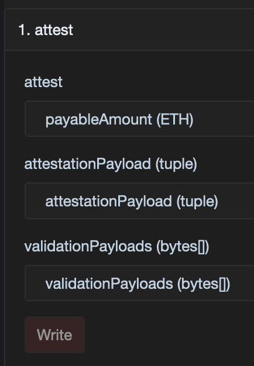

# Create an Attestation

Attestations are created through a registered portal, not by calling `AttestationRegistry` directly as an end-user.

## Portal interface

`AbstractPortalV2` exposes:

```solidity
function attest(AttestationPayload memory attestationPayload, bytes[] memory validationPayloads) public payable;
```

Payload shape:

```solidity
struct AttestationPayload {
  bytes32 schemaId;
  uint64 expirationDate;
  bytes subject;
  bytes attestationData;
}
```

`validationPayloads` contains one extra payload per module in the portal's module chain.

| Field             | Type      | Meaning                                                |
| ----------------- | --------- | ------------------------------------------------------ |
| `schemaId`        | `bytes32` | Registered schema used to interpret the payload        |
| `expirationDate`  | `uint64`  | Expiry timestamp, or `0` for no expiry                 |
| `subject`         | `bytes`   | Address, attestation ID, DID, URI, or other identifier |
| `attestationData` | `bytes`   | Encoded payload that matches the schema                |

## Registry checks

When the portal forwards the request, `AttestationRegistry` checks:

- the schema exists;
- `subject` is not empty;
- `attestationData` is not empty;
- the caller is a registered portal.

## SDK

```ts
await veraxSdk.portal.attest(
  "0xPortalAddress",
  {
    schemaId: "0xSchemaId",
    expirationDate: 0,
    subject: "0xRecipientAddress",
    attestationData: [{ isExample: true, score: 7 }],
  },
  [],
  { waitForConfirmation: true },
);
```

## Explorer or manual contract call

<figure><figcaption><p>Example explorer form for calling <code>attest</code> on a portal contract.</p></figcaption></figure>

1. Open your portal contract in the network explorer.
2. Go to the write interface for that portal contract.
3. Call `attest(attestationPayload, validationPayloads)`.
4. Read the emitted `AttestationRegistered(attestationId)` event if you need the new ID.

 Use the portal address itself here, not the registry address. 

## Notes

- `attestationId` is generated by the registry and includes the chain prefix.
- `subject` is raw bytes, so it can be an address, an attestation ID, or another identifier.
- For offchain payloads over IPFS, prefer [Offchain Payloads](../offchain-payloads.md).
