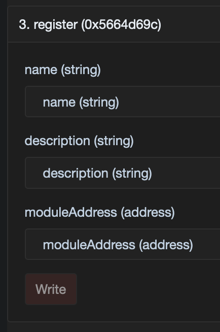

# Register a Module

[Modules](../../core-concepts/modules.md) are smart contracts that are registered in the "Module Registry" and that
perform specific validation logic on attestations before they are issued into the registry.

## Module creation

Modules are intended to perform a single specific function. They should be designed to be minimalistic, atomic, and
reusable. Modules can be chained together in series so that they are executed in order, with any module in the chain
being able to prevent an attestation being issued to the registry by simply reverting if its verification checks fail.

To create a module, you must deploy a smart contract that inherits the `AbstractModuleV2` abstract contract, which looks
like this:

```solidity
abstract contract AbstractModuleV2 {
  function run(
    AttestationPayload calldata attestationPayload,
    bytes calldata validationPayload,
    address initialCaller,
    uint256 value,
    address attester,
    address portal,
    OperationType operationType
  ) public virtual;
}
```

The `run` function accepts seven arguments:

1. `attestationPayload`, the raw attestation data that will be stored in the registry
2. `validationPayload`, validation logic that the module needs to execute its verification logic
3. `initialCaller`, the address of the initial transaction sender
4. `value`, the amount of ETH paid to get this attestation
5. `attester`, the address defined by the Portal as the attester for this payload
6. `portal`, the address of the Portal issuing the attestation
7. `operationType`, the type of operation being performed (`Attest`, `BulkAttest`, `Replace`, or `BulkReplace`)

The `validationPayload` can be any data, which may encompass fields from the attestation metadata or additional data
such as ZKP proof, a signature, merkle proof, and so on.

As well as implementing the `AbstractModuleV2` interface, the module contract must also implement the
[IERC165Upgradeable](https://github.com/OpenZeppelin/openzeppelin-contracts-upgradeable/blob/master/contracts/utils/introspection/IERC165Upgradeable.sol)
interface, which involves including this function:

```solidity
function supportsInterface(bytes4 interfaceID) public pure override returns (bool) {
  return interfaceID == type(AbstractModuleV2).interfaceId || interfaceID == type(IERC165Upgradeable).interfaceId;
}
```

## Module registration

Module registration takes 3 parameters, defined as follows:

<table><thead><tr><th width="173.84946236559142">Parameter</th><th>Description</th></tr></thead><tbody><tr><td>name</td><td>A descriptive name for the module that's stored on-chain</td></tr><tr><td>description</td><td>A link to an off-chain document that describes the module</td></tr><tr><td>moduleAddress</td><td>The address of the module smart contract</td></tr></tbody></table>

## Manually registering a deployed Module in the `ModuleRegistry` contract

Once you have deployed your module contract, you can then register it in the `ModuleRegistry` contract using the
`register` function:

```solidity
function register(string memory name, string memory description, address moduleAddress);
```

**A few caveats:** a module contract must be first deployed and cannot be registered twice under different names, and it
must implement the interfaces described above. Also, the `name` parameter must not be empty.

## Using a blockchain explorer

Instead of crafting the smart contract call by hand, you can benefit from a chain explorer interface. Let's use the
Linea Sepolia explorer, [Lineascan](https://sepolia.lineascan.build).

<figure><figcaption><p>The form generated by Lineascan to interact with the <code>ModuleRegistry</code> contract</p></figcaption></figure>

1. Retrieve the `ModuleRegistry` contract address from the
   [project README](https://github.com/Consensys/linea-attestation-registry?tab=readme-ov-file#contracts-addresses)
2. Access the `ModuleRegistry` contract on
   [Lineascan](https://sepolia.lineascan.build/address/0x3C443B9f0c8ed3A3270De7A4815487BA3223C2Fa)
3. Go to the ["Contract" tab](https://sepolia.lineascan.build/address/0x3C443B9f0c8ed3A3270De7A4815487BA3223C2Fa#code)
4. Go to the
   ["Write as Proxy" tab](https://sepolia.lineascan.build/address/0x3C443B9f0c8ed3A3270De7A4815487BA3223C2Fa#writeProxyContract)
5. Connect your allow-listed wallet and fill the `register` form with the parameters described above
6. Send the transaction

## Using the official Verax SDK

We have seen rather manual ways to register a Module, now let's focus on the easiest way: via the Verax SDK.

 Check
[this page](https://docs.ver.ax/verax-documentation/developer-guides/tutorials/from-a-schema-to-an-attestation#id-2.-instantiate-the-verax-sdk)
to discover how to instantiate the Verax SDK. 

Once you have an SDK instance, you can register a Module like this:

```typescript
await veraxSdk.module.register(
  "ExampleModule",
  "This Module is used as an example",
  "0xda14ac2b6fb17cca948ea74a051af75c92998643",
);
```

---

To dive deeper on exactly how the `ModuleRegistry` contract works, you can check out the
[source code on GitHub](https://github.com/Consensys/linea-attestation-registry/blob/dev/contracts/src/ModuleRegistry.sol).

Once you have deployed one or more schemas and optionally also deployed one or more modules, you are ready to register a
[portal](register-a-portal.md) and tie them all together so that you can issue your first attestations.
