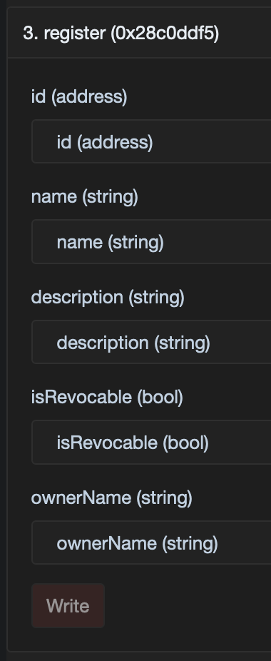

# Register a Portal

Register a portal only when you deployed a custom portal yourself. Default portals created through
`deployDefaultPortal(...)` are already registered.

## Onchain interface

Custom portals are registered in `PortalRegistry`:

```solidity
function register(
  address id,
  string calldata name,
  string calldata description,
  bool isRevocable,
  string calldata ownerName
) public;
```

Protocol checks:

- the portal address must be a deployed contract;
- `name`, `description`, and `ownerName` must be non-empty;
- the contract must support the `AbstractPortalV2` interface;
- the same address cannot be registered twice.

On mainnets, registration is allowlist-gated. On testnets, it is permissionless.

## SDK

```ts
await veraxSdk.portal.register(
  "0xPortalAddress",
  "Example Portal",
  "Custom portal registered in Verax",
  true,
  "Example Issuer",
  { waitForConfirmation: true },
);
```

## Explorer or manual contract call

<figure><figcaption><p>Example explorer form for calling <code>register</code> on <code>PortalRegistry</code>.</p></figcaption></figure>

1. Find the `PortalRegistry` address in [Networks and Addresses](../networks-and-addresses.md).
2. Open the contract page in your network explorer.
3. Go to the write interface.
4. Call `register(id, name, description, isRevocable, ownerName)`.

## What registration makes visible

Portal registration is what makes the following discoverable:

- owner address;
- module list;
- revocability;
- human-readable name and description.
